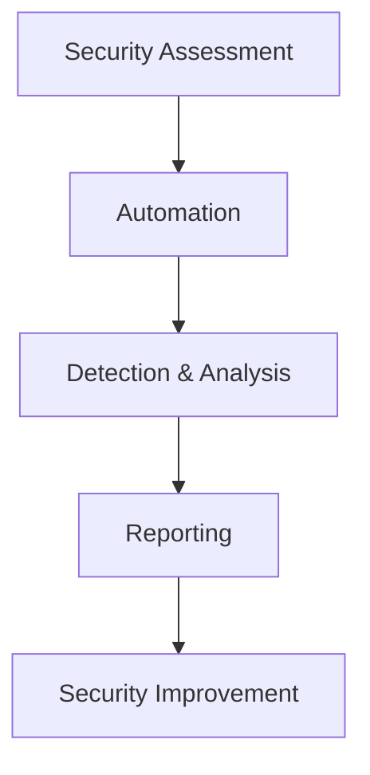

# Dibyataru Chakraborty

### Cybersecurity Analyst · Security Automation · Application Security · Python

Cybersecurity professional focused on **security assessment, vulnerability research, security automation, and defensive tooling**.

I build practical security tools and automation workflows designed to improve **system visibility, security validation, vulnerability detection, and security operations**.

My interests sit at the intersection of **Application Security, Endpoint Security, Security Engineering, OSINT, and Python automation**.

---

## 🔐 Security Focus

- Application Security & Web Security
- Vulnerability Assessment & Security Testing
- OWASP Top 10
- Windows & Linux Security Hardening
- Security Baseline & Benchmark Auditing
- Endpoint Detection & Response
- Security Automation & Reporting
- OSINT & Reconnaissance
- Authentication & Access Control
- Log Analysis & Security Monitoring
- Secure Development Practices

---

## 🛠️ Technical Skills

### 🔒 Cybersecurity

`OWASP` `Burp Suite` `Nmap` `Wireshark` `Metasploit` `YARA`

### 🐍 Programming & Automation

`Python` `Bash` `PowerShell` `JavaScript`

### 🌐 Web & Backend

`React` `Node.js` `Express.js` `Next.js` `REST APIs`

### 🖥️ Systems & Infrastructure

`Windows` `Linux` `Docker` `Git`

### 🗄️ Databases & Cloud

`MongoDB` `Firebase`

---

## 🚀 Featured Projects

| Project | Description |
|---|---|
| **Windows Security Benchmark** | Python-based security auditing and baseline validation for Windows environments. |
| **Linux Security Benchmark** | Security auditing and configuration assessment tooling for Linux systems. |
| **Qrpay** | Python and Firebase-based application developed with a focus on secure application design. |
| **DigiSamurai** | Security and DevOps community platform built with modern web technologies. |
| **Security Automation Tools** | Python-based utilities for security assessment, analysis, reconnaissance, and reporting. |

> 🔒 Security-sensitive implementation details, credentials, infrastructure information, client information, and target-specific data are intentionally excluded from public repositories.

---

## 🧠 Currently Exploring

- Advanced Web Application Security
- Security Automation with Python
- Endpoint Detection & Response
- Windows & Linux Security Architecture
- Vulnerability Research
- Threat Detection & Log Analysis
- Secure Authentication & Authorization
- Security Assessment Automation
- Detection Engineering

---

## 🧪 Security Research & Labs

I use controlled labs and authorized environments to explore:

- Web application vulnerabilities
- Authentication & authorization weaknesses
- Security misconfigurations
- Endpoint security controls
- Detection engineering
- Reconnaissance techniques
- Security automation
- Defensive security tooling
- System hardening and security baselines

All security testing is performed in **authorized environments for security research, testing, and educational purposes**.

---

## 📚 Documentation & Write-ups

Technical research, lab work, security notes, and project documentation will be published progressively.

### Planned Topics

- Security Assessment Write-ups
- Web Security Labs
- Windows & Linux Hardening
- Detection Engineering
- Security Automation
- Vulnerability Research
- Defensive Security Techniques

---

## 🔭 What I'm Building

Currently interested in building practical security tooling around:

The goal is to turn repetitive security tasks into **reliable, auditable, and reusable workflows**.

---

## 📈 GitHub

My repositories contain security research, automation projects, development experiments, and practical tooling.

> ⭐ Check out the repositories below to explore my current work.

---

## 🤝 Connect

  

---

### 💡 Security is not just about finding weaknesses — it's about understanding them, reducing risk, and building better systems.

  Building • Breaking in Labs • Automating • Learning • Securing

